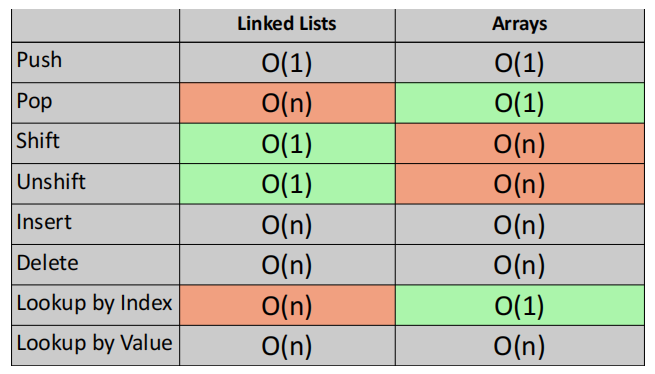

AKA -> Null terminated list

Big O ->
Adding at end -> O(1) - DONE
Removing from end -> O(n) - DONE

Adding at start -> O(1) - DONE
Removing from start -> O(1) - DONE

Inserting at middle -> O(n)
Removing from middle -> O(n)

Find -> O(n)

